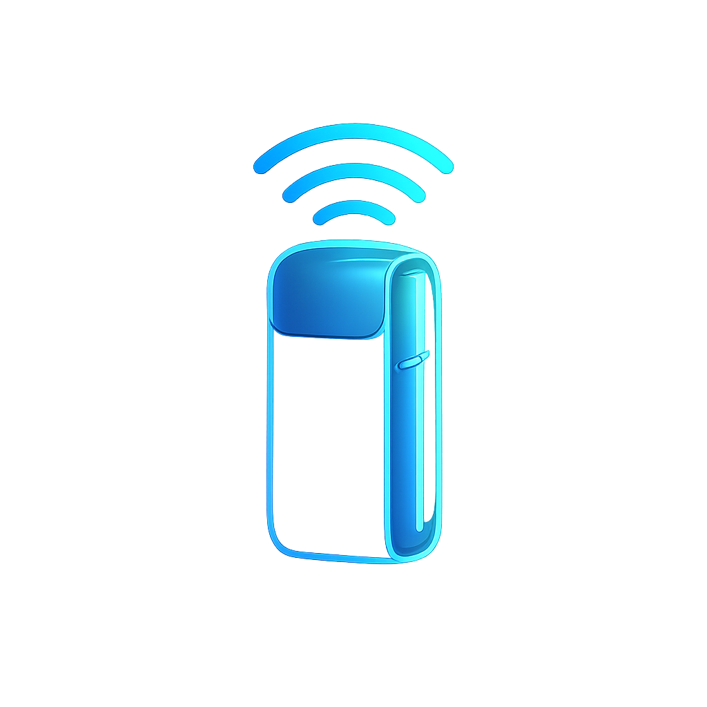
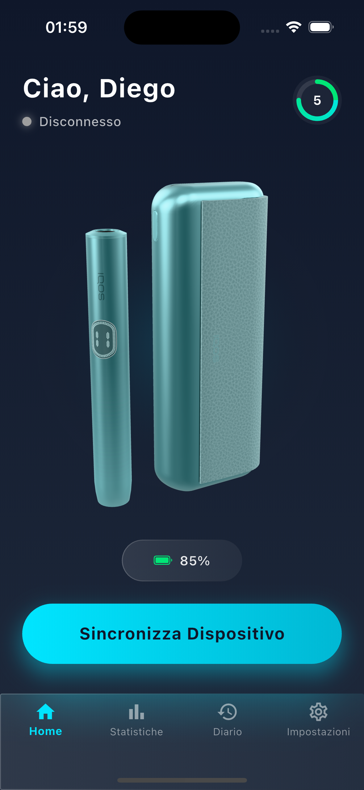
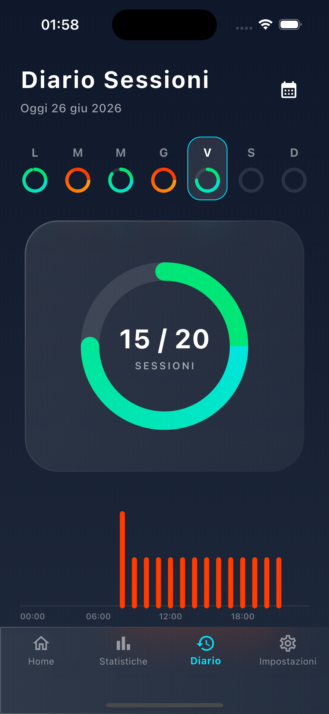
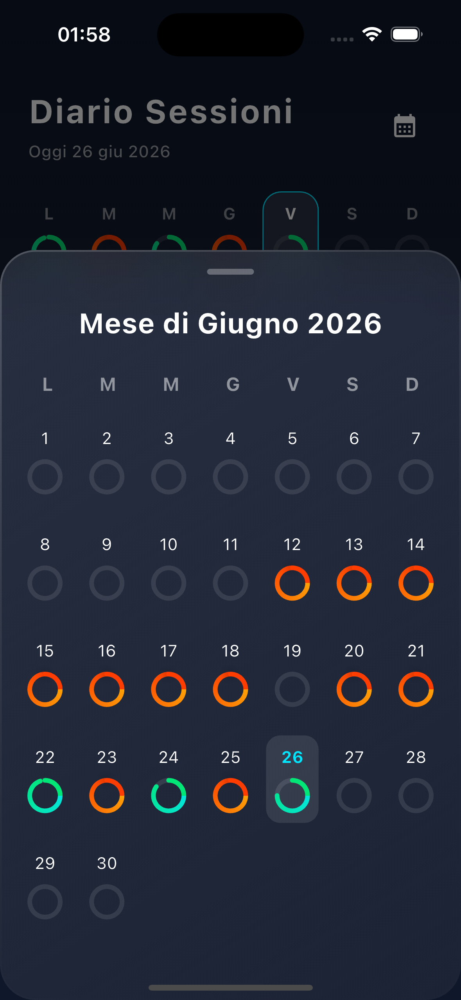
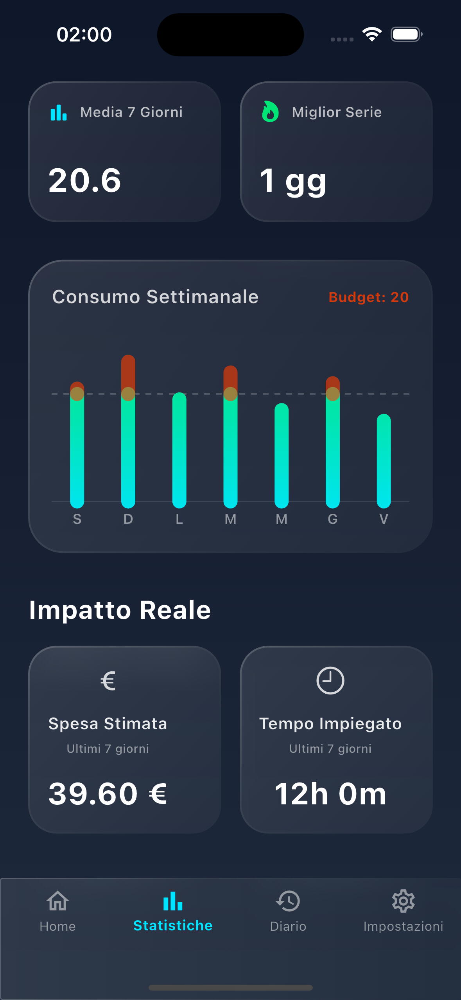

# TrackCase (In fase di sviluppo)

<p align="center">
  
</p>

TrackCase è una soluzione hardware e software integrata progettata per scansionare, tracciare e monitorare un dispositivo Iqos utilizzando il Bluetooth Low Energy (BLE) e un'applicazione companion per smartphone.

## App Screenshots

<p align="center">
  
  
</p>
<p align="center">
  
  
  </p>

## 🏗 Architettura

Questo repository è organizzato come un monorepo che contiene sia il firmware per il dispositivo di tracciamento sia l'applicazione mobile per l'utente.

- **[`/firmware`](./firmware)**: Progetto C++ per PlatformIO destinato al dispositivo ESP32 (SuperMini ESP32-C3). Utilizza la libreria `NimBLE` per la comunicazione Bluetooth a doppio ruolo: agisce come dispositivo centrale (central) per scansionare l'Iqos e come server periferico (peripheral) per connettersi all'app sullo smartphone.
- **[`/app`](./app)**: Applicazione mobile sviluppata in Flutter che si connette al dispositivo di tracciamento ESP32, fornendo un'interfaccia utente intuitiva per visualizzare lo stato del tracciamento, gestire il dispositivo e ricevere avvisi.
- **[`/docs`](./docs)**: Documentazione, diagrammi dell'architettura e immagini.

## 🚀 Per Iniziare

### Requisiti Hardware
- **ESP32-C3 SuperMini** (o scheda ESP32 compatibile)
- Un cavo micro-USB o USB-C per il flashing del firmware

### Requisiti Software
- **PlatformIO IDE** (estensione per VSCode)
- **Flutter SDK** (v3.0+)
- **Android Studio** o **Xcode** (per lo sviluppo e l'emulazione mobile)

### 1. Flash del Firmware

1. Apri la cartella [`firmware/`](./firmware) in VSCode con l'estensione PlatformIO installata.
2. Collega il tuo ESP32-C3 tramite USB.
3. Attendi che PlatformIO risolva le dipendenze (come `NimBLE-Arduino`).
4. Compila e carica il progetto sulla tua scheda utilizzando la barra laterale di PlatformIO oppure eseguendo il comando `pio run -t upload`.

### 2. Avvio dell'App

1. Apri la cartella [`app/`](./app) nel tuo IDE preferito (VSCode o Android Studio).
2. Scarica le dipendenze di Flutter eseguendo:
   ```bash
   flutter pub get
   ```
3. Collega un dispositivo fisico iOS/Android oppure avvia un emulatore.
4. Avvia l'app:
   ```bash
   flutter run
   ```

## 🛠 Funzionalità

- **BLE a Doppio Ruolo (Double Duty BLE)**: L'ESP32 funge contemporaneamente da scanner BLE (per trovare l'Iqos) e da server BLE (per comunicare con il telefono).
- **App Multipiattaforma**: Applicazione Flutter reattiva e dal design accattivante, compatibile sia con iOS che con Android.
- **Basso Consumo Energetico**: Gestione della memoria e intervalli di scansione ottimizzati sull'ESP32 per preservare la batteria.

## 🤝 Contribuire

Contributi, segnalazioni di problemi (issues) e richieste di nuove funzionalità sono i benvenuti! Sentiti libero di consultare la pagina delle issues.

## 📄 Licenza

Questo progetto è distribuito sotto la Licenza MIT - consulta il file [LICENSE](LICENSE) per i dettagli.
